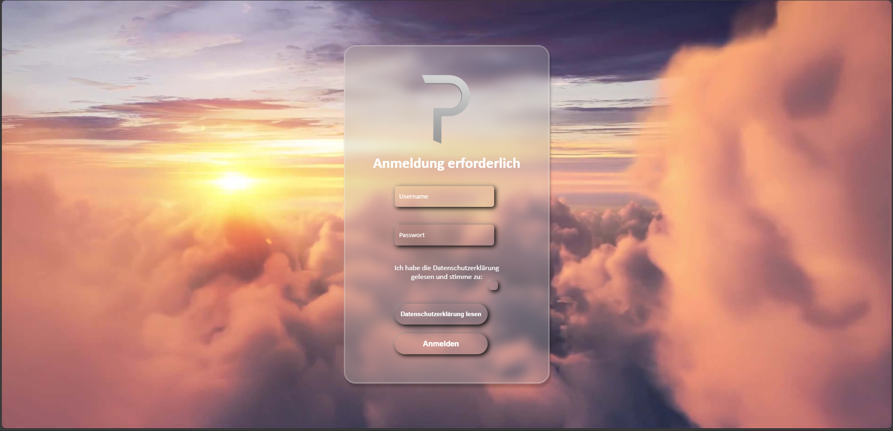
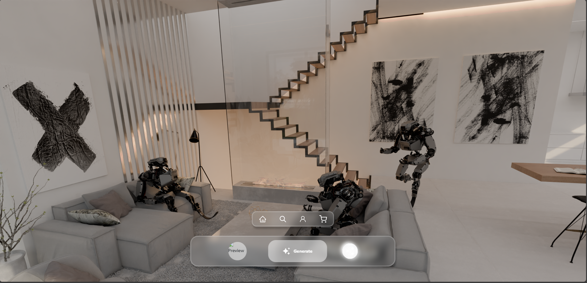
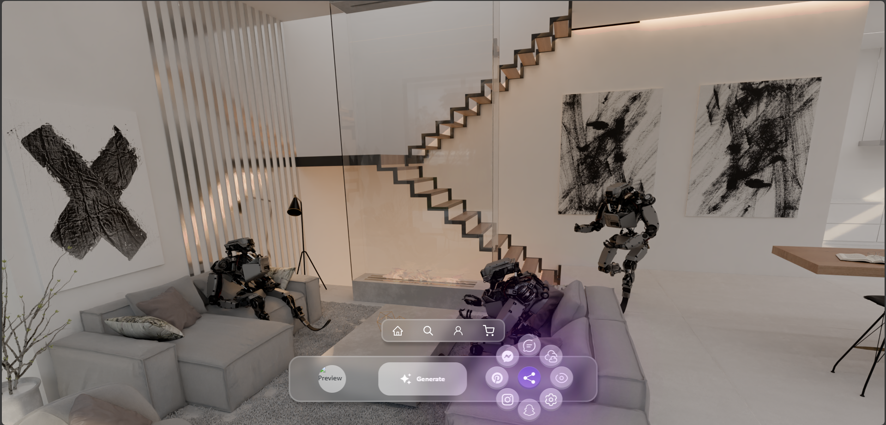
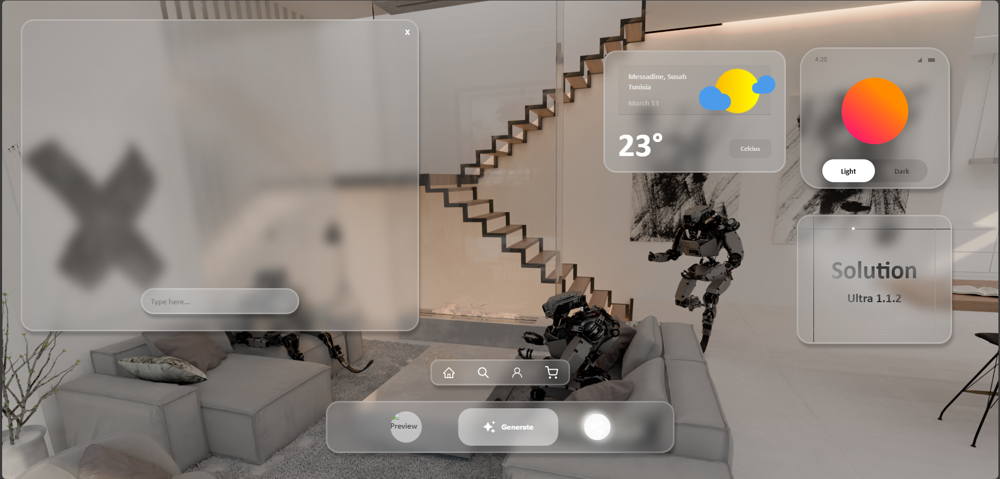
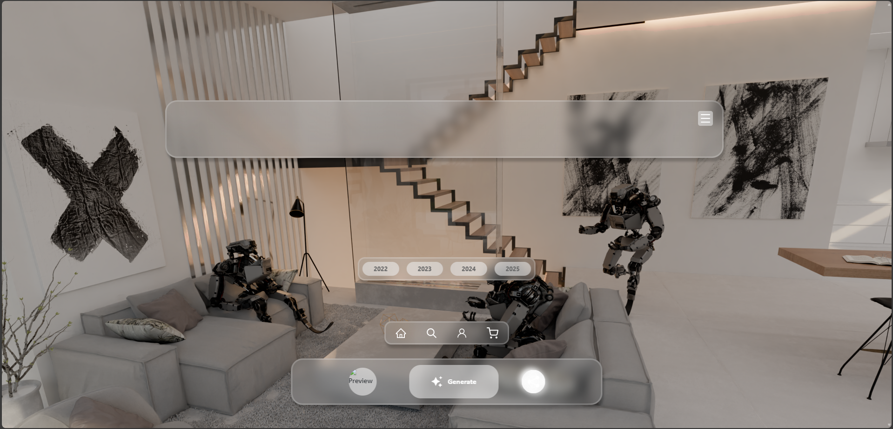

    

 

 
 

 
 

 
 

 
 

 
 

## Solution 2

Solution 2 is an experimental AI-powered video chat assistant.
You can have real-time conversations with it, and it also analyzes what's happening in the camera feed — enabling interactive and context-aware responses.

💡 Designed to explore the fusion of video communication and AI perception.

⚠️ Note: This project is currently undocumented and has not been updated since August 2024. Use at your own risk.

Peharge

## News

- **[2024.10.01]** Start ;-)
- **[2024.10.03]** Basic main4.py (Probleme [Checkliste](#checkliste))
- **[2024.10.05]** Test main2-test.py (Ist nur für Text -> Audio, kann verwendet werden für Testzwecke)
- **[2026.01.01]** Solution III

## Design

  
  
  
  
  

## Lizenz

Dieses Projekt ist unter der MIT-Lizenz lizenziert – siehe die [LICENSE](LICENSE) Datei für Details.

### **_Peharge Terminal_**
_Peharge Projects 2024_

